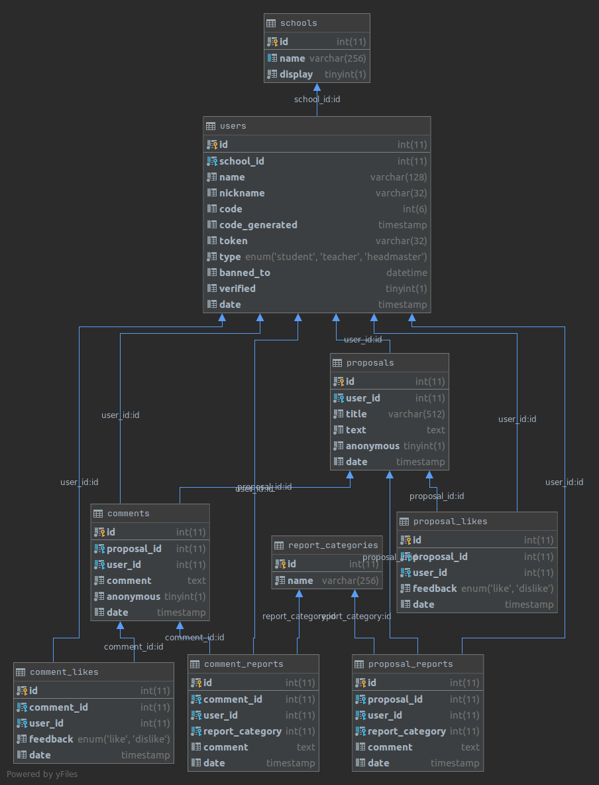

# Dumka Go
Before trying to run the application, please rename `.env.example` to `.env` and config environmental variables

# DB structure

Check out `assets/db.sql` for the full SQL code (tested on `MariaDB`)

# API Endpoints

These examples were taken from projects mainly using [Django Rest
Framework](https://github.com/tomchristie/django-rest-framework) and so the
JSON responses are often similar to the way in which DRF makes responses.

Where full URLs are provided in responses they will be rendered as if service
is running on 'http://testserver/'.

## Open Endpoints

Open endpoints require no Authentication.

* `POST /v1/status` - _API Status_ ([Example](assets/api/status.http) | [Route](src/api/status.go))
* `POST /v1/schools` - _Schools_  ([Example](assets/api/schools.http) | [Route](src/api/schools.go))
* `POST /v1/report_categories` - _Report Categories_ ([Example](assets/api/report_categories.http) | [Route](src/api/report_categories.go))
* `POST /v1/auth` - _Authentication_ ([Example](assets/api/report_categories.http) | [Route](src/api/report_categories.go))

